# Projeto BD3 - ETL e Modelagem de Data Warehouse (Dataset Olist)

Este projeto tem como objetivo desenvolver um fluxo completo de Engenharia de Dados e Business Intelligence usando os ficheiros públicos da operação de e-commerce da Olist. O pipeline cobre desde o processo de ETL (Extração, Transformação e Carga) dos dados brutos até à modelagem e alimentação de um Data Warehouse (DW) alojado em PostgreSQL.

## Tema do Projeto

O dataset utilizado representa uma operação real de e-commerce e contém informações sobre clientes, pedidos, artigos vendidos, produtos, vendedores, pagamentos, avaliações e geolocalização. 

A proposta é simular uma rotina corporativa de engenharia de analytics: preparar os dados brutos, garantir a qualidade da informação e modelar um ambiente analítico robusto (Constellation Schema) capaz de responder a perguntas estratégicas de negócio sobre vendas, logística e satisfação, de forma ágil e precisa.

---

## 1. Processo de ETL (Tratamento e Limpeza)

O notebook principal de extração e tratamento encontra-se em `notebooks/etl_olist.ipynb`. Ele lê os ficheiros brutos da pasta `dataset/` e aplica as seguintes regras de qualidade:

### Regras de Tratamento Aplicadas
- **Padronização de textos:** Remoção de espaços no início e no fim, conversão para letras minúsculas, normalização de acentos e padronização das UFs (Estados) em maiúsculas.
- **CEPs (Códigos Postais):** Os valores são convertidos para texto e preenchidos com zeros à esquerda até 5 caracteres.
- **Datas:** Conversão rigorosa para `datetime`. Datas inválidas são transformadas em valores nulos.
- **Valores Ausentes:** Categorias ausentes recebem `sem_categoria`. Comentários ausentes recebem texto vazio. Medidas físicas numéricas recebem a mediana.
- **Duplicados:** Os registos duplicados são removidos de todas as tabelas. Para geolocalização, os registos são agregados por prefixo de CEP.
- **Inconsistências:** Valores financeiros ou físicos negativos (`price`, `freight_value`) são convertidos para zero ou nulos.

### Granularidade e Atributos Derivados
Para suportar o Data Warehouse, **não realizamos agregações** nas tabelas de pagamentos e avaliações no ETL, mantendo a granularidade original do evento. Foram criados atributos analíticos como:
- Agrupamentos temporais (`ano_pedido`, `mes_pedido`, `trimestre_pedido`, `dia_semana_pedido`)
- Métricas logísticas (`dias_entrega`, `dias_estimados_entrega`, `atraso_dias`, `entregue_no_prazo`)
- Métricas físicas (`product_volume_cm3`)

Os ficheiros tratados são exportados para a pasta `output/` prontos para a carga no DW.

---

## 2. Modelagem do Data Warehouse (Constellation Schema)

Para evitar problemas de cardinalidade e garantir elevada performance, o DW foi modelado num Esquema de Constelação, isolando as métricas em Tabelas Fato distintas que partilham Dimensões Conformadas.

### Diagrama Entidade-Relacionamento (ERD)

```mermaid
erDiagram
    %% ================= DIMENSÕES =================
    
    dim_tempo {
        int sk_tempo PK "Formato AAAAMMDD"
        date data_completa UK
        int ano
        int mes
        int trimestre
        varchar dia_semana
    }
    
    dim_cliente {
        int sk_cliente PK "SERIAL"
        varchar bk_customer_unique_id UK "Business Key"
        varchar customer_zip_code_prefix
        varchar customer_city
        varchar customer_state
    }
    
    dim_produto {
        int sk_produto PK "SERIAL"
        varchar bk_product_id UK "Business Key"
        varchar product_category_name
        varchar product_category_name_english
        numeric product_weight_g
        numeric product_volume_cm3
    }
    
    dim_vendedor {
        int sk_vendedor PK "SERIAL"
        varchar bk_seller_id UK "Business Key"
        varchar seller_city
        varchar seller_state
    }
    
    dim_forma_pagamento {
        int sk_forma_pagamento PK "SERIAL"
        varchar payment_type
    }

    %% ================= FATOS =================

    fato_vendas {
        int sk_vendas PK "SERIAL"
        int fk_tempo FK
        int fk_cliente FK
        int fk_produto FK
        int fk_vendedor FK
        varchar dd_order_id "Dimensão Degenerada"
        int dd_order_item_id "Dimensão Degenerada"
        numeric preco_item
        numeric valor_frete
        numeric valor_total_item
    }

    fato_pagamentos {
        int sk_pagamentos PK "SERIAL"
        int fk_tempo FK
        int fk_cliente FK
        int fk_forma_pagamento FK
        varchar dd_order_id "Dimensão Degenerada"
        int dd_payment_sequential "Dimensão Degenerada"
        numeric valor_pagamento
        int parcelas_pagamento
    }

    fato_logistica {
        int sk_logistica PK "SERIAL"
        int fk_tempo_compra FK
        int fk_tempo_aprovacao FK
        int fk_tempo_postagem FK
        int fk_tempo_entrega_real FK
        int fk_tempo_entrega_estimada FK
        int fk_cliente FK
        int fk_vendedor_principal FK
        varchar dd_order_id "Dimensão Degenerada"
        int dias_para_aprovacao
        int dias_para_postagem
        int dias_em_transito
        int dias_totais_entrega
        int dias_atraso
        int flag_atrasado
    }

    fato_satisfacao {
        int sk_satisfacao PK "SERIAL"
        int fk_tempo_review FK
        int fk_cliente FK
        int fk_produto FK
        int fk_vendedor FK
        varchar dd_review_id "Dimensão Degenerada"
        varchar dd_order_id "Dimensão Degenerada"
        int review_score
        int flag_tem_comentario
        int tempo_resposta_horas
    }

    %% ================= RELACIONAMENTOS =================

    dim_tempo ||--o{ fato_vendas : "ocorre_em"
    dim_cliente ||--o{ fato_vendas : "realiza"
    dim_produto ||--o{ fato_vendas : "contém"
    dim_vendedor ||--o{ fato_vendas : "fornece"

    dim_tempo ||--o{ fato_pagamentos : "ocorre_em"
    dim_cliente ||--o{ fato_pagamentos : "paga"
    dim_forma_pagamento ||--o{ fato_pagamentos : "utiliza"

    dim_tempo ||--o{ fato_logistica : "marcos_temporais (Role-Playing)"
    dim_cliente ||--o{ fato_logistica : "destino_entrega"
    dim_vendedor ||--o{ fato_logistica : "origem_postagem"

    dim_tempo ||--o{ fato_satisfacao : "avaliado_em"
    dim_cliente ||--o{ fato_satisfacao : "escreve"
    dim_produto ||--o{ fato_satisfacao : "avalia"
    dim_vendedor ||--o{ fato_satisfacao : "julga"
```



### Dicionário de Restrições e Arquitetura
- **Surrogate Keys (SK):** Geradas sequencialmente no banco de dados (`SERIAL`), isolando o DW das chaves do sistema transacional.
- **Business Keys (BK):** As chaves originais receberam restrição `UNIQUE` para garantir a integridade dos processos de UPSERT.
- **Matriz de Barramento (Bus Matrix):** Capacidade de cruzar relatórios (*Drill-Across*) através das Dimensões Comuns (ex: Produto, Tempo, Cliente).

---

## 3. Perguntas de Negócio Suportadas (Escopo Prático)

As questões analíticas abaixo foram selecionadas para garantir um elevado impacto estratégico ao mesmo tempo que viabilizam o desenvolvimento ágil das queries SQL através de agregações e rankings.

### Inteligência de Clientes (Customer Success & Growth)
* **Comportamento de Recompra:** Qual é a percentagem de clientes que realizaram mais do que uma compra na plataforma, e como o ticket médio desse grupo se compara aos clientes de compra única?
* **Top Clientes (Curva ABC Básica):** Quem são os 100 clientes que geraram o maior volume de receita histórica para a plataforma, e de que estados compram predominantemente?
* **Impacto da Satisfação no Ticket:** Existe uma variação significativa no ticket médio (valor gasto) entre clientes que avaliam a compra com notas elevadas (4 e 5) versus notas baixas (1 e 2)?

### Logística, Desempenho e SLA
* **Mapa de Atrasos:** Quais são os 5 estados com a maior média de dias de atraso na entrega, e como esse atraso impacta diretamente a nota média de avaliação nessas regiões?
* **Eficiência Temporal:** Qual é a proporção de pedidos entregues no prazo versus pedidos atrasados, analisada trimestre a trimestre ao longo dos anos operacionais?
* **Barreira Logística (Frete):** Qual é a representatividade média do valor do frete em relação ao valor total pago pelo artigo, e em que categorias de produtos o frete pesa mais?

### Saúde Financeira e Meios de Pagamento
* **Alavancagem de Ticket por Parcelamento:** De que forma o método de pagamento principal e o número de parcelas escolhidas impactam o ticket médio das vendas?
* **Sazonalidade de Faturação:** Qual é a evolução da faturação bruta mensal da plataforma, e qual o mês/ano que registou o pico histórico de vendas?
* **Aderência de Crédito:** Quais são as 10 categorias de produtos que mais dependem de financiamento longo (vendas com mais de 6 parcelas) para escoarem o stock?

### Catálogo de Produtos e Mercado
* **Qualidade do Catálogo:** Os produtos que possuem descrições mais longas ou um número maior de fotografias recebem, em média, notas de avaliação mais elevadas dos consumidores?
* **Concentração de Receita (Vendedores):** Quais são os top 10 vendedores que mais faturam na plataforma, e qual é a percentagem de atraso nas entregas que saem desses vendedores?
* **Tração de Mercado:** Quais são as 5 categorias de produtos mais vendidas em volume (quantidade de artigos) e quais as 5 que mais geram receita financeira bruta?

---

## 4. Estrutura do Repositório

```text
projetobd3-etl-dw/
├── dataset/                    # Ficheiros CSV originais da Olist (Brutos)
├── notebooks/
│   ├── etl_olist.ipynb         # Extrator, padronizador e transformador
│   └── load_dw.ipynb           # Script de carga (UPSERTs e DDL do PostgreSQL)
├── output/                     # CSVs tratados gerados pelo ETL para a staging
├── docker-compose.yml          # Aprovisionamento da infraestrutura (Postgres)
└── README.md                   # Documentação do projeto
```

## 5. Como Executar o Projeto

1. **Suba a infraestrutura do Banco de Dados:**
   No diretório raiz do projeto, execute o Docker Compose para instanciar o PostgreSQL localmente no porto `5433`:
   ```bash
   docker compose up -d
   ```
2. **Instale as dependências:**
   Crie um ambiente virtual ou use o Poetry para instalar as bibliotecas necessárias:
   ```bash
   pip install pandas numpy sqlalchemy psycopg2-binary jupyter
   ```
3. **Execute o pipeline completo:**
   Para rodar todo o fluxo automaticamente, execute o script abaixo na raiz do projeto:
   ```powershell
   .\run_pipeline.ps1
   ```
   O script executa, em sequência, os notebooks `notebooks/etl_olist.ipynb`, `notebooks/load_dw.ipynb` e `notebooks/create_views_dw.ipynb`, gerando os CSVs tratados, carregando o Data Warehouse e criando as views analíticas.

   Caso o PowerShell bloqueie a execução do script local, utilize:
   ```powershell
   powershell -ExecutionPolicy Bypass -File .\run_pipeline.ps1
   ```

---

## 6. Divisão Sugerida para a Equipa

1. **Integrante 1:** Entendimento do dataset, dicionário de dados e perfilamento inicial.
2. **Integrante 2:** Implementação e manutenção do pipeline ETL no Pandas (notebook `etl_olist.ipynb`).
3. **Integrante 3:** Configuração do Docker, criação do DDL no PostgreSQL e script de carga (`load_dw.ipynb`).
4. **Integrante 4:** Documentação (README), testes de qualidade de dados e elaboração das queries SQL (Views) para validação das respostas de negócio.
